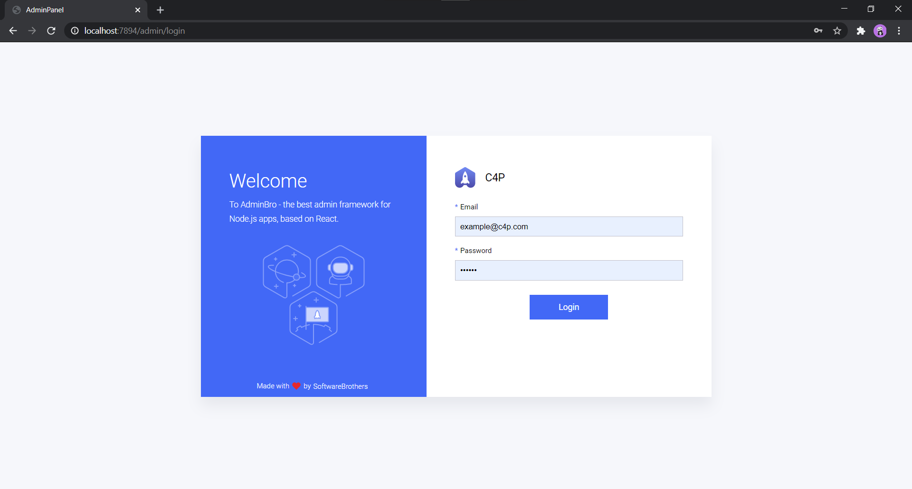
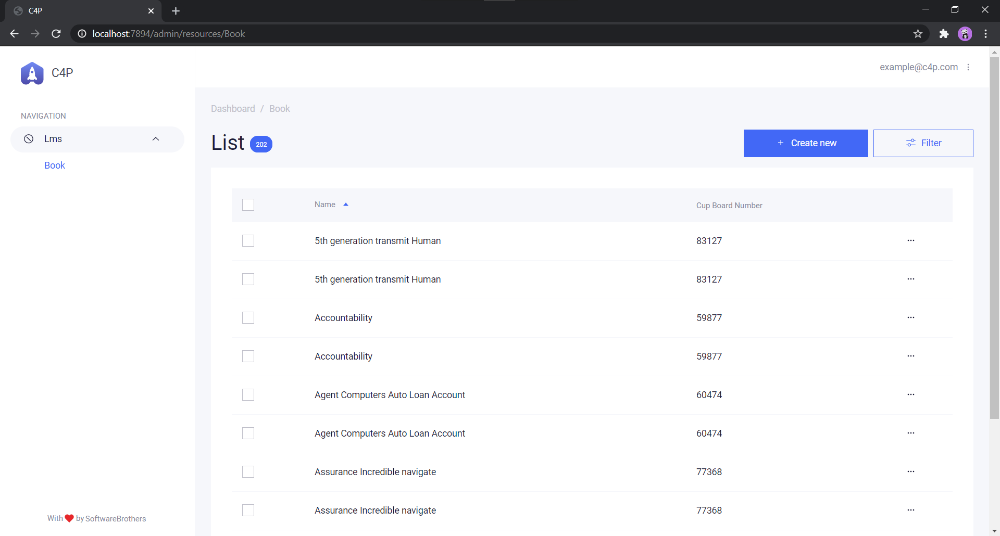
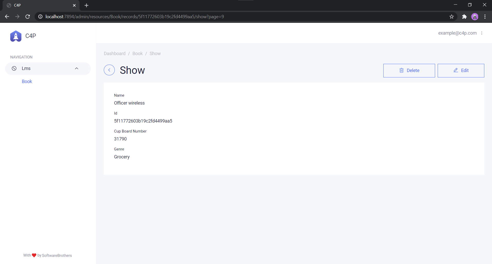

# A library book management system API #


[](https://coveralls.io/github/Swarag-N/Library-Management-System?branch=master)

`See Docs of` [Library-Management-System](https://swarag-n.github.io/Library-Management-System/)

`POSTMAN Docs` [here]('postman/postman.md')

## API Documentation ##

Base URL for all endpoints
`https://localhost:7894/`

Start `MongoDB` Service

Run

```javascript
npm install //Install all Depedencies
npm run start //Starts in localhost:7894
```

### Test API ###

```console
http://localhost:7894/api-docs
```

### `Book` Model ###

| Key       | Type          | Description |
| --------- | ------------- | ----------- |
| _id        |ObjectId      | Unique ID for the `Book` |
| name      | String        | The `Book` Name |
| cupBoardNumber      | Integer        | The `Book`'s Location |
| genre      | String        | The `Book` genre |
| _v        | Number        | Version number of the `Book` |

### `Book` Endpoints ###

Get Deatils of Books.

#### Routes ####

|Name|Method|Route|
|---|---|---|
|[List](#endpoint-list)|`GET`| `/api/books/`|
|[Show](#endpoint-show)|`GET`| `/api/books/:id`|
|[Create](#endpoint-create)|`POST`| `/api/books/:id`|
|[Update](#endpoint-update)|`PUT`| `/api/books/:id/edit`|
|[Delete](#endpoint-delete)|`DELETE`|`/api/books/:id`|

[Read more](./endpoints/books)

### Book List Query ###

|Parameter|Query|Type|Options|Default|Description|
|---|---|---|---|---|---|
|[Page Number](#Page-Number)|`page`|Number| `>1` |`1`|Each Page Is Limited to return 10 results, for more results pass page number|
|[Name](#Name)|`name`|String|`utf-8 string`|`' '`|Key Word of Book Name can be used to search|
|[Genre](#Genre)|`genr`|String|`utf-8 string`|`' '`|Filter by Genre or search by genre|
|[Sort](#Sort)|`sort`|String|```['asc','desc']```|`asc`|Sort Book by CBN|
|[Cup Board Number(CBN)](#Cup-Board-Number(CBN))|`cbNum`|Number| `>1` |`1`|Filters Books with Cupboard Number Greater than given|
|[Less Than (CBN)](#Less-Than-(CBN))|`lte`|boolean|```[true, false]```|`false`|To get Books less than a particular Number Must be passed with (CBN)|

[Read More](./endpoints/bookQuery)

### `Admin` Endpoints ###

GUI of Data (in DB),

Library by [AdminBro](https://github.com/SoftwareBrothers/admin-bro).

## Endpoint ##

`GET /admin/`

To be called in Browser.

Has Authentication

### Creds ###

|Eamil|Password|
|--- | ---|
|example@c4p.com|coding|

### Login ###



### DashBoard ###



### Show/Edit ###



## Completed Tasks ##

- [x] RESTfull Api
- [x] CRUD Routes
- [x] Paginated Results
- [x] Filter Routes
- [x] Admin Panel with Authentication
- [x] Postman Requests
- [x] User Model
- [x] JWT Auth
- [x] Config for Deployment

## Todo ##

- [ ] Middlewares to Authenticate and Authorize
- [ ] Add Tests for User Routes
