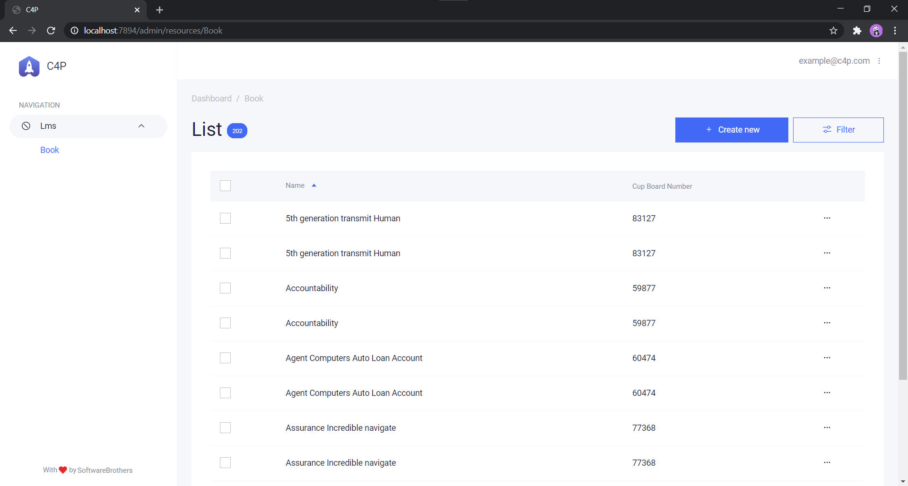

# `Admin` Endpoints #

GUI of Data (in DB),

Library by [AdminBro](https://github.com/SoftwareBrothers/admin-bro).

[Home](../index.md)

## Endpoint ##

`GET /admin/`

To be called in Browser.

Has Authentication

### Creds ###

|Eamil|Password|
|--- | ---|
|example@c4p.com|coding|

### Login ###

### DashBoard ###

### Show/Edit ###

